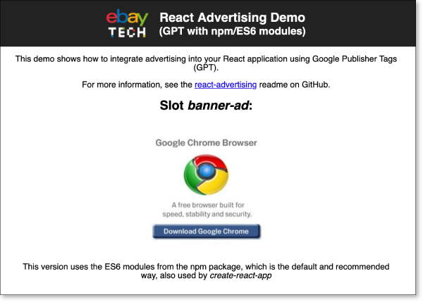

On this page, we'll explain the basic usage of _react-advertising_ with Google Publisher Tags (GPT). If you are using
Prebid, skip ahead to the [[Usage-with-Prebid]] page.

## Contents

- [Demo](#demo)
- [Installing the Package](#installing-the-package)
- [Including External Libraries](#including-external-libraries)
- [Adding the Provider](#adding-the-provider)
- [Adding the Slots](#adding-the-slots)

## Demo

You can find the complete code of this tutorial online on [CodeSandbox](https://codesandbox.io/s/gpt-npmes6-3vnx7).

[](https://codesandbox.io/s/gpt-npmes6-3vnx7)

## Installing the Package

Assuming you already have an application that uses React, install the _react-advertising_ package as a production
dependency with npm:

    npm install --save react-advertising

**Note:** Your React version should be at least version 16.3. Older versions of React are not supported.

## Including External Libraries

You need to load an external library, _gpt.js_, just the same way you would do with a “classic”, non-React web page.

The script tags that load and initialize this library needs to be included in your static HTML code.

Example for including the snippets in an HTML file:

```html
<!DOCTYPE html>
<html lang="en">
  <head>
    <meta charset="utf-8" />
    <title>Demo</title>
    <script async src="//securepubads.g.doubleclick.net/tag/js/gpt.js"></script>
    <script>
      var googletag = googletag || {};
      googletag.cmd = googletag.cmd || [];
    </script>
  </head>
  <body>
    <!-- rest of your HTML code goes here -->
  </body>
</html>
```

## Adding the Provider

The basic handling of initializing your ad slots and managing the bidding process is done by an
[[AdvertisingProvider|API#advertisingprovider]] component.

You pass your ad slot configuration to this provider, which then initializes GPT when the page is loaded.

The provider should wrap your main page content, which contains the ad slots.

Example:

```jsx
import React from 'react';
import { AdvertisingProvider } from 'react-advertising';

const config = {
  slots: [
    {
      id: "banner-ad",
      path: "/6355419/Travel/Europe/France/Paris",
      sizes: [[300, 250]]
    }
  ]
};

function MyPage() {
  return (
    <div>
      <AdvertisingProvider config={config}>
        <h1>Hello World</h1>
      </AdvertisingProvider>
    </div>
  );
);
```

The configuration in this example is taken from the
[Getting Started](https://developers.google.com/publisher-tag/guides/get-started) page of the GPT documentation. It
configures one ad slot with a 300x250 medium rectangle banner, to be displayed in the HTML div element with id
`banner-ad`.

For details on how to set up the configuration, refer to the documentation's [[Configuration]] section.

**Note:** If you use [react-router](https://github.com/ReactTraining/react-router), you can use one provider per route
with different configurations per route (i.e. per page).

## Adding the Slots

Finally, with the provider in place, you can add slot components that display the ads from the ad server.

This library includes a component [[AdvertisingSlot|API#advertisingslot]] that you can use to put div elements on your
page that are filled with creatives from the ad server.

The final code example:

```jsx
import React from 'react';
import { AdvertisingProvider, AdvertisingSlot } from 'react-advertising';

const config = {
  slots: [
    {
      id: "banner-ad",
      path: "/6355419/Travel/Europe/France/Paris",
      sizes: [[300, 250]]
    }
  ]
};

function MyPage() {
  return (
    <div>
      <AdvertisingProvider config={config}>
        <h1>Hello World</h1>
        <h2>Slot 1</h2>
        <AdvertisingSlot id="banner-ad" />
    );
);
```

**Note:** The critical part about the ad slot is the _id_ prop – it corresponds to the IDs in your configuration and is
used by the script from the ad server to find your container div in the page's DOM.

You can also add CSS classes to the _AdvertisingSlot_ component (using the _className_ prop) or inline styles (using the
_style_ prop).

---

← [[Home]] | [[Usage with Prebid]] →
